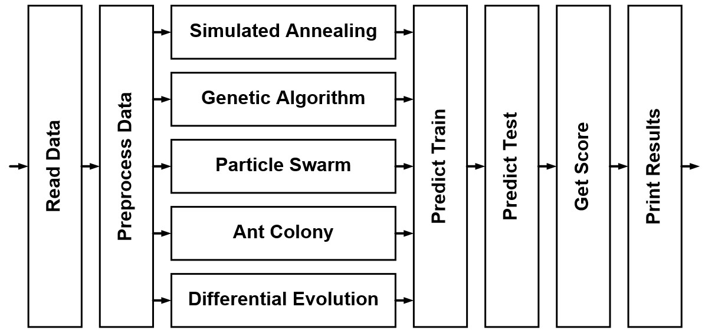

# Logistic Regression problem utilizing Meta-heuristic Algorithms

## Overview
This project is produce due to misunderstanding of HW1. The flow chart of this project is as follows

* Read Data: directly read the data from the excel file

* Preprocess Data
(1) Add cross terms $x_ix_j$ (We ignore the triple terms $x_ix_jx_k$ since it requires large memory)
(2) Select 30 features with the maximum absolute pearson correlation (This heuristic is selected based on the concept that larger correlation implies higher prediction accuracy)

* Simulated Annealing (SA)
(1) Initialize temperature
(2) Randomly select a solution
(3) Calculate neighbor solution (We add random values on the previous solution)
(4) If the neighbor sol. has better cost, update the sol. Otherwise, update the sol. with a probability based on the difference
(5) Reduce temperature
(6) Return to (3) and run until iteration terminates

* Genetic Algorithm (GA)
(1) Generate random parent genes
(2) Calculate fitness of all parent genes and leave the best few with better fitness
(3) Apply single point crossover within the remain parent genes to generate children genes (The remain parents and the childern will have the same amount as the original parent)
(4) Apply mutation on the children genes
(5) Return to (2) and run until iteration terminates

* Particle Swarm (PS)
(1) Generate random particles
(2) Initialize velocity
(3) Calculate fitness of each particles
(4) Update the velocity of each particle by the best fitness
(5) Update the particle by its velocity
(6) Return to (3) and run until iteration terminates

* Ant Colony (AC)
(1) Randomly generate large amount of solutions as solution space
(2) Randomly generate ants, each represent a solution (The number of ants is much smaller than the number of solution)
(3) Calculate fitness of each ants
(4) Decay pheromone of each solution
(5) Increase pheromone of the best fitness ant 
(6) Return to (2) and run until iteration terminates

* Differential Evolution (DE)
(1) Generate random parent particles
(2) Randomly select three parent particles and generate a children particles
(3) Run (2) until amount of children particles is the same as parent particles
(4) Replace a parent particle by a children particle if it has worse fitness
(5) Return to (2) and run until iteration terminates
* Predict Train: predict training data based on the coefficient
* Predict Test: predict test data set 1 based on the coefficient
* Get Score: Calculate the mean accuracy
* Print Results: Output all the prediction results in table format 

## Objective function
In this problem, the number of training samples is $n_x$, the number of features in each data is $n_f$ and the number of prediction classes is $n_y$. Then the training input data is represented by $\mathbf{X}\in{R}^{n_x\times{}n_f}$, the training output is $\mathbf{y}\in{R}^{n_x\times{}1}$, and the coefficient $\mathbf{c}_{n_y}\in{R}^{n_f\times{}1}$. Notice that $\mathbf{X}$ and $\mathbf{X}$ are given, and the goal is to find the optimal coefficient $\mathbf{c}$. The predicted output date is defined as $\hat{\mathbf{y}}=p(\mathbf{X}\mathbf{c}_{n_y})$ where
$p(x)=
\begin{cases}
1,\ \text{when}\ x>0.5\\
0,\ \text{otherwise}\end{cases}$.
Therefore, the objective function of this problem is $\frac{\sum1(\mathbf{y},\mathbf{y})}{n_x}$, representing the prediction accuracy, where 
$1(x_1,x_2)=
\begin{cases}
1,\ \text{when}\ x_1=x_2\\
0,\ \text{otherwise}\end{cases}$.

## Performance Results
The trainging performance:
| Algor.   |   Class 1 |   Class 2 |   Class 3 |   Class 4 |   Class 5 |   Mean Acc. |
|----------|-----------|-----------|-----------|-----------|-----------|-------------|
| SA       |  0.830109 |  0.830109 |  0.830345 |  0.832232 |  0.990326 |    0.862624 |
| GA       |  0.830109 |  0.830109 |  0.830345 |  0.836008 |  0.979471 |    0.861208 |
| PS       |  0.903728 |  0.894998 |  0.830345 |  0.870458 |  1        |    0.899906 |
| AC       |  0.852053 |  0.855828 |  0.830345 |  0.833648 |  0.995281 |    0.873431 |
| DE       |  0.903964 |  0.90184  |  0.830345 |  0.906088 |  1        |    0.908447 |
The validation performance:
| Algor.   |   Class 1 |   Class 2 |   Class 3 |   Class 4 |   Class 5 |   Mean Acc. |
|----------|-----------|-----------|-----------|-----------|-----------|-------------|
| SA       |  0.831579 |  0.831579 |  0.831579 |  0.831579 |  0.997895 |    0.864842 |
| GA       |  0.831579 |  0.831579 |  0.831579 |  0.833684 |  0.901053 |    0.845895 |
| PS       |  0.903158 |  0.884211 |  0.831579 |  0.890526 |  1        |    0.901895 |
| AC       |  0.858947 |  0.84     |  0.831579 |  0.814737 |  0.989474 |    0.866947 |
| DE       |  0.913684 |  0.915789 |  0.831579 |  0.924211 |  1        |    0.917053 |

## Analysis
