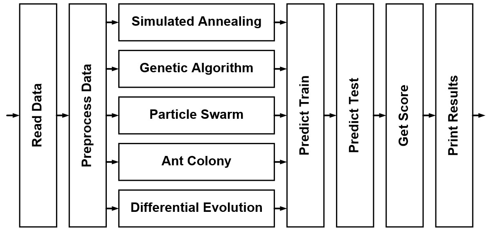
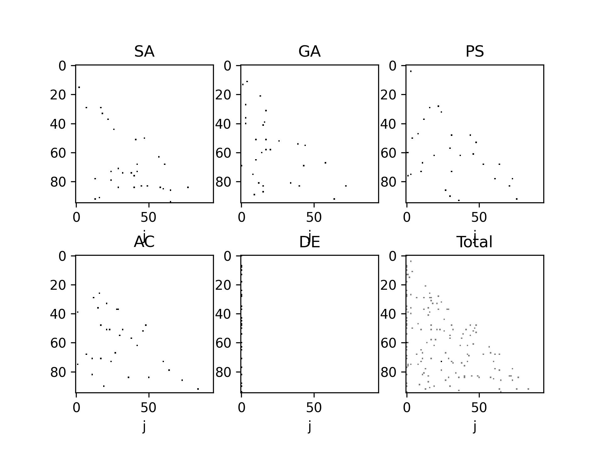
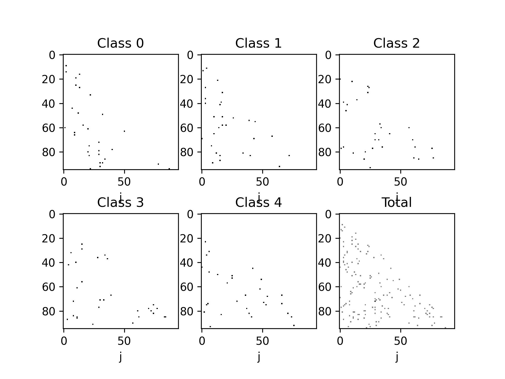
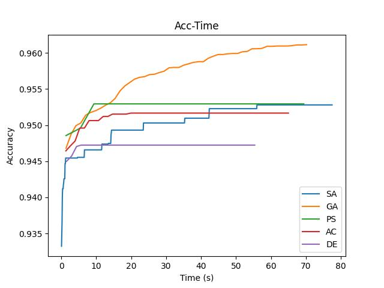

# Bio-marker selection problem for logistic regression model utilizing Meta-heuristic Algorithms

## Overview
The flow chart of this project is as follows

* Read Data: directly read the data from the excel file

* Preprocess Data
(1) Add cross terms $x_ix_j$ (We ignore the triple terms $x_ix_jx_k$ since it requires large memory)
(2) The above data is set as the solution space. The goal is to find 30 selection from it.

* Simulated Annealing (SA)
(1) Initialize temperature
(2) Randomly select a solution
(3) Calculate neighbor solution (We randomly pick a bio-marker for the first 30 selection)
(4) If the neighbor sol. has better cost, update the sol. Otherwise, update the sol. with a probability based on the difference of the cost and the current temperature.
(5) Reduce temperature
(6) Return to (3) and run until iteration terminates

* Genetic Algorithm (GA)
(1) Generate random parent genes
(2) Calculate fitness of all parent genes and leave the best few with better fitness
(3) Apply single point crossover within the remain parent genes to generate children genes (The remain parents and the childern will have the same amount as the original parent)
(4) Apply mutation on the children genes (randomly select one bio-marker and replace by a random bio-marker)
(5) Return to (2) and run until iteration terminates

* Particle Swarm (PS) : Swarm intelligent based
(1) Generate random particles
(2) Calculate fitness of each particles
(3) Update the particle based on the local best, global best or random perturbation
(4) Return to (2) and run until iteration terminates

* Ant Colony (AC)
(1) Randomly generate large amount of solutions as solution space (Our graph is contruct by single layer with number of sample nodes)
(2) Randomly generate ants, each represent a solution (The number of ants is much smaller than the number of solution)
(3) Calculate fitness of each ants
(4) Decay pheromone of each solution
(5) Increase pheromone of the best fitness ant 
(6) Return to (2) and run until iteration terminates

* Differential Evolution (DE)
(1) Generate random parent particles
(2) Randomly select three parent particles and generate a children particles
(3) Run (2) until amount of children particles is the same as parent particles
(4) Replace a parent particle by a children particle if it has worse fitness
(5) Return to (2) and run until iteration terminates
* Predict Train: predict training data by logistic regression based on the selected index
* Predict Test: predict test data set based on the previous logistic regression model

## Simulation Setting
| Algor.   |   Num. of particle |   Num. of iterations |   
|----------|-----------|-----------|
| SA       |  1 | 1000 |
| GA       |  10 |  100 |
| PS       |  10 |  100 |
| AC       |  10 |  100 |
| DE       |  10 |  100 |

## Objective function
In this problem, the number of training samples is $n_s$, the number of features in each data is $n_f$ and the number of prediction classes is $n_y$. Then the training input data is represented by $\mathbf{X}\in{R}^{n_s\times{}n_f}$ and the training output is $\mathbf{y}\in{R}^{n_s\times{}1}$. 
The objective function of this problem is
$\argmin{}_{\mathcal{I}\in{\mathcal{A}}}\frac{\sum1(\mathbf{y},\hat{\mathbf{y}})}{n_s}$, representing the prediction accuracy, where $\hat{\mathbf{y}}$ is generate from the logistic regression model $LR(\mathbf{X}_{:,\mathcal{I}},\mathbf{y})$ and the $1(.)$ function is defined as
$1(x_1,x_2)=
\begin{cases}
1,\ \text{when}\ x_1=x_2\\
0,\ \text{otherwise}\end{cases}$.

## Performance Results
The trainging performance:
| Algor.   |   Class 1 |   Class 2 |   Class 3 |   Class 4 |   Class 5 |   Mean Acc. |
|----------|-----------|-----------|-----------|-----------|-----------|-------------|
| SA       |  0.964842 |  0.954932 |  0.876357 |  0.959179 |         1 |    0.951062 |
| GA       |  0.967437 |  0.958943 |  0.907504 |  0.961538 |         1 |    0.959084 |
| PS       |  0.958943 |  0.957291 |  0.884379 |  0.958707 |         1 |    0.951864 |
| AC       |  0.963426 |  0.957055 |  0.878952 |  0.958707 |         1 |    0.951628 |
| DE       |  0.962718 |  0.956583 |  0.86621  |  0.956583 |         1 |    0.948419 |
The validation performance:
| Algor.   |   Class 1 |   Class 2 |   Class 3 |   Class 4 |   Class 5 |   Mean Acc. |
|----------|-----------|-----------|-----------|-----------|-----------|-------------|
| SA       |  0.966316 |  0.938947 |  0.848421 |  0.962105 |         1 |    0.943158 |
| GA       |  0.970526 |  0.932632 |  0.858947 |  0.978947 |         1 |    0.948211 |
| PS       |  0.981053 |  0.941053 |  0.858947 |  0.974737 |         1 |    0.951158 |
| AC       |  0.974737 |  0.932632 |  0.837895 |  0.964211 |         1 |    0.941895 |
| DE       |  0.983158 |  0.938947 |  0.833684 |  0.968421 |         1 |    0.944842 |

## Bio-marker Selection Results
The follow figure shows the selection of each algorithm for class 2

In this figure, the $i,j$ represents the two-way bio-marker $x_ix_j$while $i,i$ represents the ony-way bio-marker $x_i$
We find that the bio-marker selection are totally different.
The follow figure shows the selection of each algorithm for class GA

Similarly, the selected bio-markers are mostly different.

We define $T_{i,j}$ as the two way ratio $D_iD_j$ if $i=j$; otherwise, $T_{i,j}$ is define as the one-way ratio $D_i$ (Notice that the index start from 0)
Also, $D_i$ is define as $\frac{F_k}{R_l}$ where $k=i\ \text{mod}\ 19$ and $l=\lfloor\frac{i}{5}\rfloor$
The 30 bio-marker selection for each algorithm and each class is shown as follows:
#### SA
* Class 0
$T_{ 91 , 9 },T_{ 92 , 59 },T_{ 53 , 67 },T_{ 86 , 27 },T_{ 72 , 75 },T_{ 67 , 14 },T_{ 91 , 25 },T_{ 89 , 68 },T_{ 85 , 31 },T_{ 4 , 77 },T_{ 40 , 45 },T_{ 52 , 18 },T_{ 7 , 62 },T_{ 31 , 84 },T_{ 90 , 11 },T_{ 88 , 11 },T_{ 62 , 28 },T_{ 33 , 74 },T_{ 72 , 88 },T_{ 78 , 9 },T_{ 49 , 15 },T_{ 51 , 18 },T_{ 54 , 80 },T_{ 77 , 71 },T_{ 69 , 88 },T_{ 13 , 11 },T_{ 25 , 17 },T_{ 13 , 46 },T_{ 92 , 7 },T_{ 86 , 75 },$
* Class 1
$T_{ 20 , 5 },T_{ 57 , 61 },T_{ 16 , 67 },T_{ 45 , 40 },T_{ 24 , 27 },T_{ 79 , 59 },T_{ 84 , 67 },T_{ 16 , 9 },T_{ 44 , 27 },T_{ 64 , 87 },T_{ 42 , 65 },T_{ 62 , 28 },T_{ 62 , 2 },T_{ 64 , 53 },T_{ 64 , 88 },T_{ 61 , 74 },T_{ 64 , 93 },T_{ 16 , 44 },T_{ 16 , 93 },T_{ 72 , 86 },T_{ 70 , 5 },T_{ 15 , 55 },T_{ 15 , 63 },T_{ 78 , 23 },T_{ 32 , 58 },T_{ 34 , 17 },T_{ 65 , 16 },T_{ 93 , 31 },T_{ 35 , 59 },T_{ 81 , 4 },$
* Class 2
$T_{ 60 , 1 },T_{ 4 , 3 },T_{ 70 , 9 },T_{ 21 , 6 },T_{ 63 , 41 },T_{ 0 , 76 },T_{ 63 , 67 },T_{ 72 , 69 },T_{ 71 , 15 },T_{ 39 , 58 },T_{ 65 , 72 },T_{ 66 , 23 },T_{ 10 , 56 },T_{ 12 , 56 },T_{ 86 , 0 },T_{ 6 , 3 },T_{ 81 , 12 },T_{ 42 , 18 },T_{ 11 , 76 },T_{ 62 , 23 },T_{ 43 , 23 },T_{ 30 , 86 },T_{ 22 , 24 },T_{ 27 , 67 },T_{ 32 , 93 },T_{ 78 , 9 },T_{ 2 , 52 },T_{ 58 , 67 },T_{ 80 , 79 },T_{ 84 , 17 },$
* Class 3
$T_{ 30 , 53 },T_{ 16 , 25 },T_{ 91 , 77 },T_{ 68 , 72 },T_{ 74 , 73 },T_{ 64 , 34 },T_{ 91 , 19 },T_{ 29 , 30 },T_{ 38 , 53 },T_{ 5 , 26 },T_{ 71 , 91 },T_{ 87 , 33 },T_{ 37 , 71 },T_{ 64 , 39 },T_{ 26 , 29 },T_{ 66 , 18 },T_{ 51 , 53 },T_{ 40 , 75 },T_{ 61 , 91 },T_{ 59 , 2 },T_{ 31 , 89 },T_{ 37 , 43 },T_{ 26 , 91 },T_{ 58 , 12 },T_{ 0 , 3 },T_{ 4 , 54 },T_{ 81 , 73 },T_{ 63 , 59 },T_{ 68 , 24 },T_{ 57 , 30 },$
* Class 4
$T_{ 32 , 79 },T_{ 83 , 15 },T_{ 62 , 69 },T_{ 41 , 33 },T_{ 27 , 75 },T_{ 30 , 6 },T_{ 79 , 3 },T_{ 60 , 58 },T_{ 33 , 21 },T_{ 54 , 61 },T_{ 47 , 17 },T_{ 7 , 93 },T_{ 65 , 33 },T_{ 29 , 30 },T_{ 89 , 4 },T_{ 9 , 76 },T_{ 5 , 18 },T_{ 57 , 7 },T_{ 55 , 30 },T_{ 84 , 12 },T_{ 43 , 60 },T_{ 66 , 53 },T_{ 41 , 68 },T_{ 92 , 31 },T_{ 39 , 91 },T_{ 39 , 6 },T_{ 87 , 18 },T_{ 56 , 76 },T_{ 42 , 21 },T_{ 39 , 88 },$
#### GA
* Class 0
$T_{ 91 , 9 },T_{ 92 , 59 },T_{ 53 , 67 },T_{ 86 , 27 },T_{ 72 , 75 },T_{ 67 , 14 },T_{ 91 , 25 },T_{ 89 , 68 },T_{ 85 , 31 },T_{ 4 , 77 },T_{ 40 , 45 },T_{ 52 , 18 },T_{ 7 , 62 },T_{ 31 , 84 },T_{ 90 , 11 },T_{ 88 , 11 },T_{ 62 , 28 },T_{ 33 , 74 },T_{ 72 , 88 },T_{ 78 , 9 },T_{ 49 , 15 },T_{ 51 , 18 },T_{ 54 , 80 },T_{ 77 , 71 },T_{ 69 , 88 },T_{ 13 , 11 },T_{ 25 , 17 },T_{ 13 , 46 },T_{ 92 , 7 },T_{ 86 , 75 },$
* Class 1
$T_{ 20 , 5 },T_{ 57 , 61 },T_{ 16 , 67 },T_{ 45 , 40 },T_{ 24 , 27 },T_{ 79 , 59 },T_{ 84 , 67 },T_{ 16 , 9 },T_{ 44 , 27 },T_{ 64 , 87 },T_{ 42 , 65 },T_{ 62 , 28 },T_{ 62 , 2 },T_{ 64 , 53 },T_{ 64 , 88 },T_{ 61 , 74 },T_{ 64 , 93 },T_{ 16 , 44 },T_{ 16 , 93 },T_{ 72 , 86 },T_{ 70 , 5 },T_{ 15 , 55 },T_{ 15 , 63 },T_{ 78 , 23 },T_{ 32 , 58 },T_{ 34 , 17 },T_{ 65 , 16 },T_{ 93 , 31 },T_{ 35 , 59 },T_{ 81 , 4 },$
* Class 2
$T_{ 60 , 1 },T_{ 4 , 3 },T_{ 70 , 9 },T_{ 21 , 6 },T_{ 63 , 41 },T_{ 0 , 76 },T_{ 63 , 67 },T_{ 72 , 69 },T_{ 71 , 15 },T_{ 39 , 58 },T_{ 65 , 72 },T_{ 66 , 23 },T_{ 10 , 56 },T_{ 12 , 56 },T_{ 86 , 0 },T_{ 6 , 3 },T_{ 81 , 12 },T_{ 42 , 18 },T_{ 11 , 76 },T_{ 62 , 23 },T_{ 43 , 23 },T_{ 30 , 86 },T_{ 22 , 24 },T_{ 27 , 67 },T_{ 32 , 93 },T_{ 78 , 9 },T_{ 2 , 52 },T_{ 58 , 67 },T_{ 80 , 79 },T_{ 84 , 17 },$
* Class 3
$T_{ 30 , 53 },T_{ 16 , 25 },T_{ 91 , 77 },T_{ 68 , 72 },T_{ 74 , 73 },T_{ 64 , 34 },T_{ 91 , 19 },T_{ 29 , 30 },T_{ 38 , 53 },T_{ 5 , 26 },T_{ 71 , 91 },T_{ 87 , 33 },T_{ 37 , 71 },T_{ 64 , 39 },T_{ 26 , 29 },T_{ 66 , 18 },T_{ 51 , 53 },T_{ 40 , 75 },T_{ 61 , 91 },T_{ 59 , 2 },T_{ 31 , 89 },T_{ 37 , 43 },T_{ 26 , 91 },T_{ 58 , 12 },T_{ 0 , 3 },T_{ 4 , 54 },T_{ 81 , 73 },T_{ 63 , 59 },T_{ 68 , 24 },T_{ 57 , 30 },$
* Class 4
$T_{ 32 , 79 },T_{ 83 , 15 },T_{ 62 , 69 },T_{ 41 , 33 },T_{ 27 , 75 },T_{ 30 , 6 },T_{ 79 , 3 },T_{ 60 , 58 },T_{ 33 , 21 },T_{ 54 , 61 },T_{ 47 , 17 },T_{ 7 , 93 },T_{ 65 , 33 },T_{ 29 , 30 },T_{ 89 , 4 },T_{ 9 , 76 },T_{ 5 , 18 },T_{ 57 , 7 },T_{ 55 , 30 },T_{ 84 , 12 },T_{ 43 , 60 },T_{ 66 , 53 },T_{ 41 , 68 },T_{ 92 , 31 },T_{ 39 , 91 },T_{ 39 , 6 },T_{ 87 , 18 },T_{ 56 , 76 },T_{ 42 , 21 },T_{ 39 , 88 },$
#### PS
* Class 0
$T_{ 91 , 9 },T_{ 92 , 59 },T_{ 53 , 67 },T_{ 86 , 27 },T_{ 72 , 75 },T_{ 67 , 14 },T_{ 91 , 25 },T_{ 89 , 68 },T_{ 85 , 31 },T_{ 4 , 77 },T_{ 40 , 45 },T_{ 52 , 18 },T_{ 7 , 62 },T_{ 31 , 84 },T_{ 90 , 11 },T_{ 88 , 11 },T_{ 62 , 28 },T_{ 33 , 74 },T_{ 72 , 88 },T_{ 78 , 9 },T_{ 49 , 15 },T_{ 51 , 18 },T_{ 54 , 80 },T_{ 77 , 71 },T_{ 69 , 88 },T_{ 13 , 11 },T_{ 25 , 17 },T_{ 13 , 46 },T_{ 92 , 7 },T_{ 86 , 75 },$
* Class 1
$T_{ 20 , 5 },T_{ 57 , 61 },T_{ 16 , 67 },T_{ 45 , 40 },T_{ 24 , 27 },T_{ 79 , 59 },T_{ 84 , 67 },T_{ 16 , 9 },T_{ 44 , 27 },T_{ 64 , 87 },T_{ 42 , 65 },T_{ 62 , 28 },T_{ 62 , 2 },T_{ 64 , 53 },T_{ 64 , 88 },T_{ 61 , 74 },T_{ 64 , 93 },T_{ 16 , 44 },T_{ 16 , 93 },T_{ 72 , 86 },T_{ 70 , 5 },T_{ 15 , 55 },T_{ 15 , 63 },T_{ 78 , 23 },T_{ 32 , 58 },T_{ 34 , 17 },T_{ 65 , 16 },T_{ 93 , 31 },T_{ 35 , 59 },T_{ 81 , 4 },$
* Class 2
$T_{ 60 , 1 },T_{ 4 , 3 },T_{ 70 , 9 },T_{ 21 , 6 },T_{ 63 , 41 },T_{ 0 , 76 },T_{ 63 , 67 },T_{ 72 , 69 },T_{ 71 , 15 },T_{ 39 , 58 },T_{ 65 , 72 },T_{ 66 , 23 },T_{ 10 , 56 },T_{ 12 , 56 },T_{ 86 , 0 },T_{ 6 , 3 },T_{ 81 , 12 },T_{ 42 , 18 },T_{ 11 , 76 },T_{ 62 , 23 },T_{ 43 , 23 },T_{ 30 , 86 },T_{ 22 , 24 },T_{ 27 , 67 },T_{ 32 , 93 },T_{ 78 , 9 },T_{ 2 , 52 },T_{ 58 , 67 },T_{ 80 , 79 },T_{ 84 , 17 },$
* Class 3
$T_{ 30 , 53 },T_{ 16 , 25 },T_{ 91 , 77 },T_{ 68 , 72 },T_{ 74 , 73 },T_{ 64 , 34 },T_{ 91 , 19 },T_{ 29 , 30 },T_{ 38 , 53 },T_{ 5 , 26 },T_{ 71 , 91 },T_{ 87 , 33 },T_{ 37 , 71 },T_{ 64 , 39 },T_{ 26 , 29 },T_{ 66 , 18 },T_{ 51 , 53 },T_{ 40 , 75 },T_{ 61 , 91 },T_{ 59 , 2 },T_{ 31 , 89 },T_{ 37 , 43 },T_{ 26 , 91 },T_{ 58 , 12 },T_{ 0 , 3 },T_{ 4 , 54 },T_{ 81 , 73 },T_{ 63 , 59 },T_{ 68 , 24 },T_{ 57 , 30 },$
* Class 4
$T_{ 32 , 79 },T_{ 83 , 15 },T_{ 62 , 69 },T_{ 41 , 33 },T_{ 27 , 75 },T_{ 30 , 6 },T_{ 79 , 3 },T_{ 60 , 58 },T_{ 33 , 21 },T_{ 54 , 61 },T_{ 47 , 17 },T_{ 7 , 93 },T_{ 65 , 33 },T_{ 29 , 30 },T_{ 89 , 4 },T_{ 9 , 76 },T_{ 5 , 18 },T_{ 57 , 7 },T_{ 55 , 30 },T_{ 84 , 12 },T_{ 43 , 60 },T_{ 66 , 53 },T_{ 41 , 68 },T_{ 92 , 31 },T_{ 39 , 91 },T_{ 39 , 6 },T_{ 87 , 18 },T_{ 56 , 76 },T_{ 42 , 21 },T_{ 39 , 88 },$
#### AC
* Class 0
$T_{ 91 , 9 },T_{ 92 , 59 },T_{ 53 , 67 },T_{ 86 , 27 },T_{ 72 , 75 },T_{ 67 , 14 },T_{ 91 , 25 },T_{ 89 , 68 },T_{ 85 , 31 },T_{ 4 , 77 },T_{ 40 , 45 },T_{ 52 , 18 },T_{ 7 , 62 },T_{ 31 , 84 },T_{ 90 , 11 },T_{ 88 , 11 },T_{ 62 , 28 },T_{ 33 , 74 },T_{ 72 , 88 },T_{ 78 , 9 },T_{ 49 , 15 },T_{ 51 , 18 },T_{ 54 , 80 },T_{ 77 , 71 },T_{ 69 , 88 },T_{ 13 , 11 },T_{ 25 , 17 },T_{ 13 , 46 },T_{ 92 , 7 },T_{ 86 , 75 },$
* Class 1
$T_{ 20 , 5 },T_{ 57 , 61 },T_{ 16 , 67 },T_{ 45 , 40 },T_{ 24 , 27 },T_{ 79 , 59 },T_{ 84 , 67 },T_{ 16 , 9 },T_{ 44 , 27 },T_{ 64 , 87 },T_{ 42 , 65 },T_{ 62 , 28 },T_{ 62 , 2 },T_{ 64 , 53 },T_{ 64 , 88 },T_{ 61 , 74 },T_{ 64 , 93 },T_{ 16 , 44 },T_{ 16 , 93 },T_{ 72 , 86 },T_{ 70 , 5 },T_{ 15 , 55 },T_{ 15 , 63 },T_{ 78 , 23 },T_{ 32 , 58 },T_{ 34 , 17 },T_{ 65 , 16 },T_{ 93 , 31 },T_{ 35 , 59 },T_{ 81 , 4 },$
* Class 2
$T_{ 60 , 1 },T_{ 4 , 3 },T_{ 70 , 9 },T_{ 21 , 6 },T_{ 63 , 41 },T_{ 0 , 76 },T_{ 63 , 67 },T_{ 72 , 69 },T_{ 71 , 15 },T_{ 39 , 58 },T_{ 65 , 72 },T_{ 66 , 23 },T_{ 10 , 56 },T_{ 12 , 56 },T_{ 86 , 0 },T_{ 6 , 3 },T_{ 81 , 12 },T_{ 42 , 18 },T_{ 11 , 76 },T_{ 62 , 23 },T_{ 43 , 23 },T_{ 30 , 86 },T_{ 22 , 24 },T_{ 27 , 67 },T_{ 32 , 93 },T_{ 78 , 9 },T_{ 2 , 52 },T_{ 58 , 67 },T_{ 80 , 79 },T_{ 84 , 17 },$
* Class 3
$T_{ 30 , 53 },T_{ 16 , 25 },T_{ 91 , 77 },T_{ 68 , 72 },T_{ 74 , 73 },T_{ 64 , 34 },T_{ 91 , 19 },T_{ 29 , 30 },T_{ 38 , 53 },T_{ 5 , 26 },T_{ 71 , 91 },T_{ 87 , 33 },T_{ 37 , 71 },T_{ 64 , 39 },T_{ 26 , 29 },T_{ 66 , 18 },T_{ 51 , 53 },T_{ 40 , 75 },T_{ 61 , 91 },T_{ 59 , 2 },T_{ 31 , 89 },T_{ 37 , 43 },T_{ 26 , 91 },T_{ 58 , 12 },T_{ 0 , 3 },T_{ 4 , 54 },T_{ 81 , 73 },T_{ 63 , 59 },T_{ 68 , 24 },T_{ 57 , 30 },$
* Class 4
$T_{ 32 , 79 },T_{ 83 , 15 },T_{ 62 , 69 },T_{ 41 , 33 },T_{ 27 , 75 },T_{ 30 , 6 },T_{ 79 , 3 },T_{ 60 , 58 },T_{ 33 , 21 },T_{ 54 , 61 },T_{ 47 , 17 },T_{ 7 , 93 },T_{ 65 , 33 },T_{ 29 , 30 },T_{ 89 , 4 },T_{ 9 , 76 },T_{ 5 , 18 },T_{ 57 , 7 },T_{ 55 , 30 },T_{ 84 , 12 },T_{ 43 , 60 },T_{ 66 , 53 },T_{ 41 , 68 },T_{ 92 , 31 },T_{ 39 , 91 },T_{ 39 , 6 },T_{ 87 , 18 },T_{ 56 , 76 },T_{ 42 , 21 },T_{ 39 , 88 },$
#### DE
* Class 0
$T_{ 91 , 9 },T_{ 92 , 59 },T_{ 53 , 67 },T_{ 86 , 27 },T_{ 72 , 75 },T_{ 67 , 14 },T_{ 91 , 25 },T_{ 89 , 68 },T_{ 85 , 31 },T_{ 4 , 77 },T_{ 40 , 45 },T_{ 52 , 18 },T_{ 7 , 62 },T_{ 31 , 84 },T_{ 90 , 11 },T_{ 88 , 11 },T_{ 62 , 28 },T_{ 33 , 74 },T_{ 72 , 88 },T_{ 78 , 9 },T_{ 49 , 15 },T_{ 51 , 18 },T_{ 54 , 80 },T_{ 77 , 71 },T_{ 69 , 88 },T_{ 13 , 11 },T_{ 25 , 17 },T_{ 13 , 46 },T_{ 92 , 7 },T_{ 86 , 75 },$
* Class 1
$T_{ 20 , 5 },T_{ 57 , 61 },T_{ 16 , 67 },T_{ 45 , 40 },T_{ 24 , 27 },T_{ 79 , 59 },T_{ 84 , 67 },T_{ 16 , 9 },T_{ 44 , 27 },T_{ 64 , 87 },T_{ 42 , 65 },T_{ 62 , 28 },T_{ 62 , 2 },T_{ 64 , 53 },T_{ 64 , 88 },T_{ 61 , 74 },T_{ 64 , 93 },T_{ 16 , 44 },T_{ 16 , 93 },T_{ 72 , 86 },T_{ 70 , 5 },T_{ 15 , 55 },T_{ 15 , 63 },T_{ 78 , 23 },T_{ 32 , 58 },T_{ 34 , 17 },T_{ 65 , 16 },T_{ 93 , 31 },T_{ 35 , 59 },T_{ 81 , 4 },$
* Class 2
$T_{ 60 , 1 },T_{ 4 , 3 },T_{ 70 , 9 },T_{ 21 , 6 },T_{ 63 , 41 },T_{ 0 , 76 },T_{ 63 , 67 },T_{ 72 , 69 },T_{ 71 , 15 },T_{ 39 , 58 },T_{ 65 , 72 },T_{ 66 , 23 },T_{ 10 , 56 },T_{ 12 , 56 },T_{ 86 , 0 },T_{ 6 , 3 },T_{ 81 , 12 },T_{ 42 , 18 },T_{ 11 , 76 },T_{ 62 , 23 },T_{ 43 , 23 },T_{ 30 , 86 },T_{ 22 , 24 },T_{ 27 , 67 },T_{ 32 , 93 },T_{ 78 , 9 },T_{ 2 , 52 },T_{ 58 , 67 },T_{ 80 , 79 },T_{ 84 , 17 },$
* Class 3
$T_{ 30 , 53 },T_{ 16 , 25 },T_{ 91 , 77 },T_{ 68 , 72 },T_{ 74 , 73 },T_{ 64 , 34 },T_{ 91 , 19 },T_{ 29 , 30 },T_{ 38 , 53 },T_{ 5 , 26 },T_{ 71 , 91 },T_{ 87 , 33 },T_{ 37 , 71 },T_{ 64 , 39 },T_{ 26 , 29 },T_{ 66 , 18 },T_{ 51 , 53 },T_{ 40 , 75 },T_{ 61 , 91 },T_{ 59 , 2 },T_{ 31 , 89 },T_{ 37 , 43 },T_{ 26 , 91 },T_{ 58 , 12 },T_{ 0 , 3 },T_{ 4 , 54 },T_{ 81 , 73 },T_{ 63 , 59 },T_{ 68 , 24 },T_{ 57 , 30 },$
* Class 4
$T_{ 32 , 79 },T_{ 83 , 15 },T_{ 62 , 69 },T_{ 41 , 33 },T_{ 27 , 75 },T_{ 30 , 6 },T_{ 79 , 3 },T_{ 60 , 58 },T_{ 33 , 21 },T_{ 54 , 61 },T_{ 47 , 17 },T_{ 7 , 93 },T_{ 65 , 33 },T_{ 29 , 30 },T_{ 89 , 4 },T_{ 9 , 76 },T_{ 5 , 18 },T_{ 57 , 7 },T_{ 55 , 30 },T_{ 84 , 12 },T_{ 43 , 60 },T_{ 66 , 53 },T_{ 41 , 68 },T_{ 92 , 31 },T_{ 39 , 91 },T_{ 39 , 6 },T_{ 87 , 18 },T_{ 56 , 76 },T_{ 42 , 21 },T_{ 39 , 88 },$

## Statistical Test
We apply the ANOVA test between each pair of algorithms, the $\alpha$ value is taken as 0.05. Also, we run each algorithm for 4 times for the statistical test.
* The test of the 1st class

|group1 |group2 |meandiff| p-adj  | lower  | upper  |reject|
|-------|-------|--------|--------|--------|--------|------|
|    AC |    DE | -0.0009| 0.8405 |-0.0038 | 0.0019 | False|
|    AC |    GA |  0.0041| 0.0039 | 0.0012 | 0.0069 |  True|
|    AC |    PS | -0.0032| 0.0249 | -0.006 |-0.0003 |  True|
|    AC |    SA |  0.0021| 0.1971 |-0.0007 |  0.005 | False|
|    DE |    GA |   0.005| 0.0006 | 0.0022 | 0.0079 |  True|
|    DE |    PS | -0.0022|   0.16 |-0.0051 | 0.0006 | False|
|    DE |    SA |  0.0031| 0.0318 | 0.0002 | 0.0059 |  True|
|    GA |    PS | -0.0073|    0.0 |-0.0101 |-0.0044 |  True|
|    GA |    SA | -0.0019| 0.2652 |-0.0048 | 0.0009 | False|
|    PS |    SA |  0.0053| 0.0003 | 0.0025 | 0.0082 |  True|
* The test of the 1st class

|group1| group2| meandiff| p-adj |  lower |  upper | reject|
|------|-------|---------|-------|--------|--------|-------|
|    AC|     DE|  -0.0002| 0.9996|  -0.003|  0.0026|  False|
|    AC|     GA|   0.0032| 0.0226|  0.0004|   0.006|   True|
|    AC|     PS|  -0.0012| 0.6581|  -0.004|  0.0016|  False|
|    AC|     SA|   0.0002| 0.9996| -0.0026|   0.003|  False|
|    DE|     GA|   0.0034| 0.0155|  0.0006|  0.0062|   True|
|    DE|     PS|  -0.0011| 0.7681| -0.0039|  0.0017|  False|
|    DE|     SA|   0.0004| 0.9946| -0.0025|  0.0032|  False|
|    GA|     PS|  -0.0044| 0.0016| -0.0072| -0.0016|   True|
|    GA|     SA|   -0.003| 0.0328| -0.0058| -0.0002|   True|
|    PS|     SA|   0.0014| 0.5433| -0.0014|  0.0042|  False|
* The test of the 2st class

|group1| group2 m|eandiff |p-adj  | lower  | upper  |reject|
|------|---------|--------|-------|--------|--------|------|
|    AC|     DE  |-0.0173 |   0.0 |-0.0245 |  -0.01 |  True|
|    AC|     GA  |  0.025 |   0.0 | 0.0177 | 0.0322 |  True|
|    AC|     PS  | 0.0057 |0.1593 |-0.0015 |  0.013 | False|
|    AC|     SA  | 0.0004 |0.9998 |-0.0068 | 0.0077 | False|
|    DE|     GA  | 0.0422 |   0.0 |  0.035 | 0.0495 |  True|
|    DE|     PS  |  0.023 |   0.0 | 0.0157 | 0.0303 |  True|
|    DE|     SA  | 0.0177 |   0.0 | 0.0104 |  0.025 |  True|
|    GA|     PS  |-0.0192 |   0.0 |-0.0265 | -0.012 |  True|
|    GA|     SA  |-0.0245 |   0.0 |-0.0318 |-0.0173 |  True|
|    PS|     SA  |-0.0053 |0.2116 |-0.0126 | 0.0019 | False|
* The test of the 3st class

|group1| group2| meandiff| p-adj |  lower |  upper | reject|
|------|-------|---------|-------|--------|--------|-------|
|    AC|     DE|  -0.0022| 0.2283| -0.0054|  0.0009|  False|
|    AC|     GA|   0.0028| 0.0858| -0.0003|   0.006|  False|
|    AC|     PS|  -0.0009| 0.8805| -0.0041|  0.0022|  False|
|    AC|     SA|   0.0001|    1.0|  -0.003|  0.0032|  False|
|    DE|     GA|   0.0051| 0.0013|  0.0019|  0.0082|   True|
|    DE|     PS|   0.0013| 0.7068| -0.0018|  0.0044|  False|
|    DE|     SA|   0.0024|   0.19| -0.0008|  0.0055|  False|
|    GA|     PS|  -0.0038| 0.0149| -0.0069| -0.0006|   True|
|    GA|     SA|  -0.0027| 0.1055| -0.0058|  0.0004|  False|
|    PS|     SA|   0.0011| 0.8297| -0.0021|  0.0042|  False|
* The test of the 4st class

|group1| group2| meandiff| p-adj| lower| upper| reject|
|------|-------|---------|------|------|------|-------|
|    AC|     DE|      0.0|   nan|   0.0|   0.0|  False|
|    AC|     GA|      0.0|   nan|   0.0|   0.0|  False|
|    AC|     PS|      0.0|   nan|   0.0|   0.0|  False|
|    AC|     SA|      0.0|   nan|   0.0|   0.0|  False|
|    DE|     GA|      0.0|   nan|   0.0|   0.0|  False|
|    DE|     PS|      0.0|   nan|   0.0|   0.0|  False|
|    DE|     SA|      0.0|   nan|   0.0|   0.0|  False|
|    GA|     PS|      0.0|   nan|   0.0|   0.0|  False|
|    GA|     SA|      0.0|   nan|   0.0|   0.0|  False|
|    PS|     SA|      0.0|   nan|   0.0|   0.0|  False|
Since all algorithm has 1 accuracy in this prediction, the ANOVA test shows no difference between all of them.

## Statistical Progress Diagram Analysis
The mean accuracy of the training data to the runtime is shown as follows:

We can observe that:
(1) AC and PS can find good solution in less then 10 second, but the solution would not be improved too much after that.
(2) SA can find better solution as the iteration process runs; however, the improvement is much slower then GA.
(3) GA has improvement on the solution as the iteration process goes, and the algorithm gets the best performance after 10 seconds. This methods outperforms other methods.
In conclusion, we think that the algorithm performance comparison for this problem can be summarized as:
GA > PS > AC > SA > DE

## File Description
* model/: stores final 30 selection during running 'train.py'
* select/: stores figures for bio-marker selection
* time/: store time and accuracy info. during running 'train.py' & the acc-time figure after running 'plot_time.py'
* utils/:
    * eval.py: score evaltion functions
    * optimization.py: all optimization algorithms
    * preprocess.py: read data and set solution space
* plot_selection.py: plot the bio-marker selection and save
* plot_time.py: plot the acc-time curve
* stat_test.py: perform statiscal test
* test.py: Predict the output and store to 'Test2_Answer.xlsx'
* train.py: Run optmization algorithm on the train set to select the best indices for each classes
* valid.py: Predict the output of 'Test1.xlsx' for validating the training result.

## How to Run?
* To run the training and validation
(1) Run 'train.py'
(2) Run 'valid.py'
(3) Run 'plot_selection.py' & 'plot_time.py' for analysis
(4) Run 'test.py' to generate the answer
* To run the statistic test related code
(1) Run 'python train.py --seed 1~2', to get total 4 samples
(2) Run 'stat_test.py' for statistical test on diffrerent algorithm
