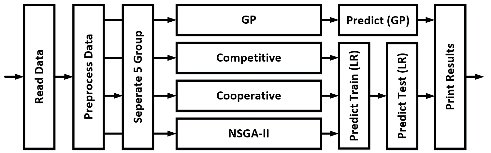
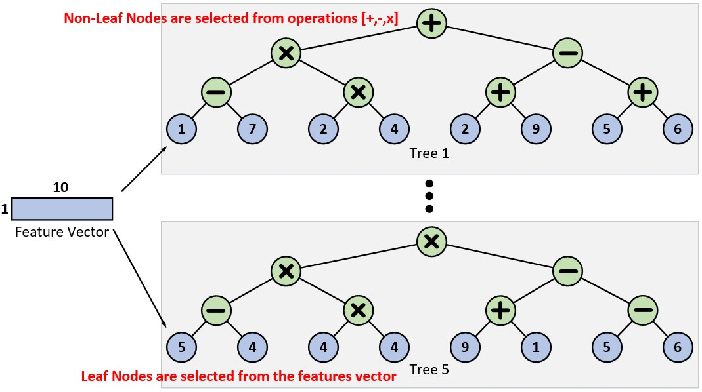
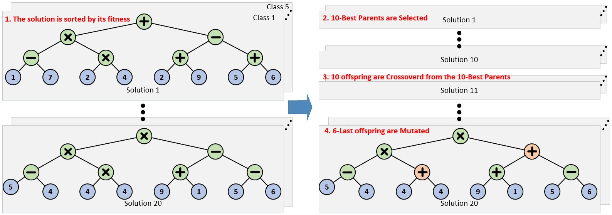
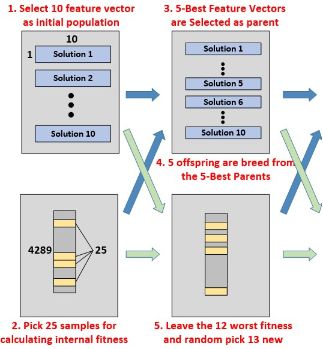
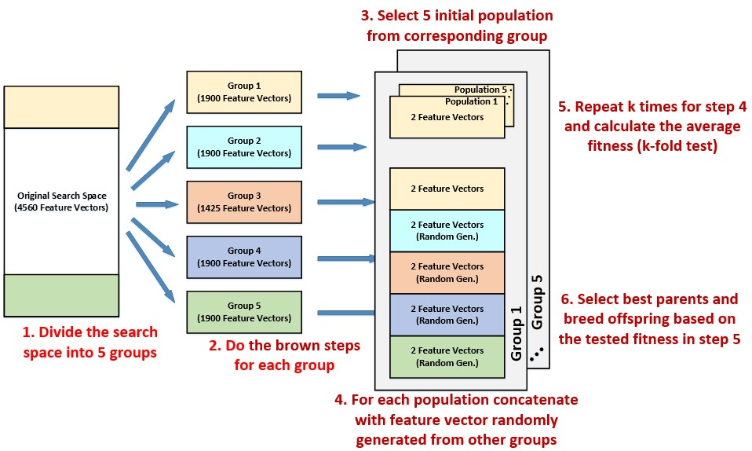

# Bio-marker selection problem 

## Overview
The flow chart of this project is as follows

* Read Data: directly read the data from the excel file
* Preprocess Data
(1) Add cross terms $x_ix_j$ (We ignore the triple terms $x_ix_jx_k$ since it requires large memory)
(2) The above data is set as the solution space. The goal is to find 30 selection from it.
* Optimization Alogrithms:
    It includes Genetic Programming (GP), Competitive Coevolution, Cooperative Coevolution, NSGA-II. The detail setting of each algorithm is describe in the following section. 
* Predict Train (LR): predict training data by logistic regression based on the selected index
* Predict Test (LR): predict test data set based on the previous logistic regression model
* Predict (GP): predict the training, valid and testing data by the tree-based model.

## Genetic Programming
### Data Structure Setting
|   Parameter |   Number |   Note |   
|----------|-----------|-----------|
| # Tree       |  5 | Each tree corresponds to a class  |
| # Operation       |  3 |  ["+","-","*"] |
| # Tree level       |  4 | The depth of the full tree  |
The following figure illustrates the above setting:

### Algorithm Setting
|   Parameter |   Number |   Note |   
|----------|-----------|-----------|
| # Generation       |  40 |  Times for the iterative algorithm to be processed |
| # Solution       |  20 | Each tree corresponds to a class  |
| # Parents       |  10 | Hald of the solution size  |
| # num_mutations       |  6 | one-third of solution size  |

### Flow Chart
The following figure illustrates the flow of GP:

Notice that in each solution, the feature vector in each class must be the same. On the other hand, the solution in the same class can have different feature vector. In our work, the feature vector will also be mutated.

### Results
#### C01
When $(T_{4377}+T_{141}*T_{3785}+T_{1609}*T_{3785}*T_{1883}+T_{518}+T_{1187})<0$ is true, C01 is 1. Otherwise, it is 0.
#### C02
When $(T_{4377}+T_{4241}*T_{1187}+T_{518}+T_{778}*T_{141}*T_{1187}+T_{3785})<0$ is true, C02 is 1. Otherwise, it is 0.
#### C03
When $(T_{1883}+T_{4377}+T_{1609}*T_{1187}*T_{4241}+T_{141}*T_{1187}*T_{1883})<0$ is true, C03 is 1. Otherwise, it is 0.
#### C04
When $(T_{4377}+T_{1609}*T_{1883}*T_{1187}+T_{518}+T_{1609}-T_{141}*T_{1883})<0$ is true, C04 is 1. Otherwise, it is 0.
#### C05
When $(T_{518}+T_{778}+T_{1609}*T_{3785}-T_{518}*T_{141}*T_{1609}+T_{1187})<0$ is true, C05 is 1. Otherwise, it is 0.

## Competitive Coevolution
### Algorithm Setting
|   Parameter |   Number |   Note |   
|----------|-----------|-----------|
| # Generation       |  10 |  Times for the iterative algorithm to be processed |
| # Internal       |  25 | Number of samples for calculating the internal Fitness  |
| # Worst Internal       |  12 | Number of worse samples leaved for the next generation  |
| # Solution       |  10 | Size of the population  |
| # Parents       |  5 | Half of the solution size  |
| # num_mutations       |  2 | number of features being mutated for the offspring  |
### Flow Chart
The following figure illustrates the flow of the algorithm:

Notice that the breeding strategy for the feature vector is implement by crossover between the parenets along with mutations.

### Results
Each class is predict by the logistic regression model $LR(.)$ based on the training data corresponding to its class. The definition of $T_i$ can be found in appendix.
#### C01
$LR([T_{4471}, T_{ 148}, T_{1148}, T_{3200}, T_{1326}, T_{1126}, T_{2316}, T_{3279}, T_{2879}, T_{1134}])$
#### C02
$LR([T_{ 322}, T_{4214}, T_{2399}, T_{4126}, T_{1501}, T_{2321}, T_{2372}, T_{2263}, T_{4355}, T_{3344}])$
#### C03
$LR([T_{4450}, T_{3727}, T_{1277}, T_{1688}, T_{2483}, T_{4525}, T_{2045}, T_{4042}, T_{1008}, T_{ 549}])$
#### C04
$LR([T_{3063}, T_{4055}, T_{4353}, T_{3052}, T_{3643}, T_{3788}, T_{1833}, T_{3369}, T_{2258}, T_{ 580}])$
#### C05
$LR([T_{ 545}, T_{1238}, T_{3097}, T_{2174}, T_{2643}, T_{2584}, T_{4223}, T_{2411}, T_{3002}, T_{3395}])$

## Cooperative Coevolution
### Algorithm Setting
|   Parameter |   Number |   Note |   
|----------|-----------|-----------|
| # Generation       |  10 |  Times for the iterative algorithm to be processed |
| # Solution       |  5 | Size of the population  |
| # Parents       |  2 | Half of the solution size  |
| # num_mutations       |  2 | number of features being mutated for the offspring  |
| # k       |  5 | k-fold test for the internal fitness  |
### Flow Chart
The following figure illustrates the flow of the algorithm:

Notice that the breeding strategy for the feature vector is implement by crossover between the parenets along with mutations.

### Results
Each class is predict by the logistic regression model $LR(.)$ based on the training data corresponding to its class. 
#### C01
$LR([T_{ 248}, T_{1296}, T_{1494}, T_{1132}, T_{ 921}, T_{1130}, T_{  85}, T_{1392}, T_{1375}, T_{ 655}])$
#### C02
$LR([T_{1139}, T_{1449}, T_{1006}, T_{1373}, T_{1025}, T_{ 953}, T_{ 960}, T_{ 221}, T_{1736}, T_{ 837}])$
#### C03
$LR([T_{1820}, T_{ 168}, T_{ 337}, T_{ 246}, T_{ 452}, T_{ 390}, T_{ 302}, T_{1662}, T_{1599}, T_{ 449}])$
#### C04
$LR([T_{ 484}, T_{1098}, T_{ 502}, T_{ 601}, T_{ 222}, T_{ 483}, T_{ 503}, T_{ 528}, T_{ 752}, T_{ 591}])$
#### C05
$LR([T_{ 318}, T_{ 747}, T_{ 221}, T_{ 248}, T_{ 236}, T_{1302}, T_{1720}, T_{ 166}, T_{1800}, T_{1824}])$

## NSGA-II
### Algorithm Setting
|   Parameter |   Number |   Note |   
|----------|-----------|-----------|
| # Generation       |  10 |  Times for the iterative algorithm to be processed |
| # Solution       |  20 | Size of the population  |
| # Parents       |  10 | Half of the solution size  |
| # num_mutations       |  2 | number of features being mutated for the offspring  |
### Flow 
(1) Access fitness for each population on Class 1, Class 2 and Class 4
(2) Select the pareto front as parents and remove them from the population
(3) Repect (2) until adding the current pareto front exceeds the number of parents. Once this condition happens, we select the most sparse solution based on its fitness. We caculate the L1 distance for the neighbors in each three dimensions and add up, and this value is used as the sparsity factor.
(4) Breed offspring based on the selected parents. The breeding process is implemented by crossover between parents along with some mutation
(5) Repeat (2)-(4)

### Results
Each class is predict by the logistic regression model $LR(.)$ based on the training data corresponding to its class. 
#### C01 & C02 & C04
$LR([T_{ 1293}, T_{854}, T_{1865}, T_{3796}, T_{ 3245}, T_{2004}, T_{  178}, T_{2524}, T_{979}, T_{ 2042}])$

## Performance Results
The training performance:
| Algor.      |   Class 1 |   Class 2 |   Class 3 |   Class 4 |   Class 5 |   Mean Acc. |
|-------------|-----------|-----------|-----------|-----------|-----------|-------------|
| GP          |  0.830109 |  0.830109 |  0.830345 |  0.830109 |  0.983011 |    0.860736 |
| Competitive |  0.918122 |  0.91883  |  0.830345 |  0.907739 |  1        |    0.915007 |
| Cooperative |  0.950684 |  0.930628 |  0.830816 |  0.918122 |  1        |    0.92605  |
| NSGA2       |  0.944313 |  0.904436 |  0.830345 |  0.921425 |  0.99882  |    0.919868 |
Notice that NSGA2 only optmizated on Class 1, 2 and 4.

The validation performance:
| Algor.      |   Class 1 |   Class 2 |   Class 3 |   Class 4 |   Class 5 |   Mean Acc. |
|-------------|-----------|-----------|-----------|-----------|-----------|-------------|
| GP          |  0.831579 |  0.831579 |  0.831579 |  0.831579 |  0.993684 |    0.864    |
| Competitive |  0.947368 |  0.909474 |  0.831579 |  0.894737 |  1        |    0.916632 |
| Cooperative |  0.983158 |  0.922105 |  0.831579 |  0.915789 |  1        |    0.930526 |
| NSGA2       |  0.976842 |  0.922105 |  0.831579 |  0.970526 |  1        |    0.940211 |
The results show comparalbe validaiton scores. However, the Cooperative coevolution seems to have less variance. It is therefore selected to generate the test results.

## File Description
* model/: stores final 10 selection during running 'train.py' (tree-based for GP)
* utils/:
    * eval.py: score evaltion functions
    * optimization.py: all optimization algorithms
    * preprocess.py: read data and set solution space
* test.py: Predict the output and store to 'Test2_Answer.xlsx' (Using Cooperative)
* train.py: Run optmization algorithm on the train set to select the best indices for each classes
* valid.py: Predict the output of 'Test1.xlsx' for validating the training result.

## How to Run?
* To run the training and validation
(1) Run 'train.py'
(2) Run 'valid.py'
(3) Run 'test.py' to generate the answer

## Appendix
### Definition of $T_i$
For $T_i$ with $i<95$ it is the ony-way biomarker $\frac{F_m}{R_n}$ where $m=(i+1)mod19$ and $n=\lceil\frac{i}{4}\rceil$
For $T_i$ with $i\geq{}95$ it is the two-way biomarker $\frac{F_mF_k}{R_nR_l}$ where $m=LUL(i-94)mod19$, $n=\lceil\frac{LUL(i-95)}{4}\rceil$, $k=(LUR(i-94))mod19$ and $l=\lceil\frac{LUR(i-95)}{4}\rceil$. The $LUL(.)$ and $LUR(.)$ function looks up the left and right value in the list $[(1,2),(1,3),\dots{},(1,95),(2,3),\dots{},(2,95),(3,4),\dots{},(3.95),\dot{}(94,95)]$